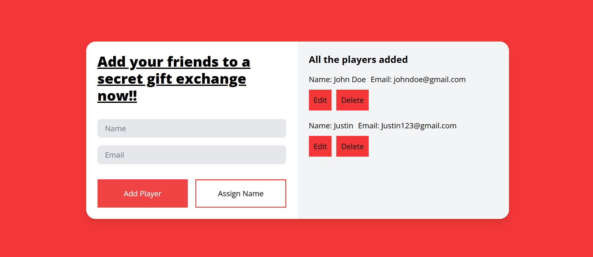

# Project Description

The Online Secret Santa Generator is a web-based application that simplifies organizing a Secret Santa gift exchange. Users can input participants' names and email addresses, and the app automatically assigns each participant a recipient to gift. Once assignments are made, the app sends an email to each participant with their assigned person while keeping the pairings confidential.

# Installation

Commands to clone the repository
`git clone [repo URL]`

To run the project
`npm install`
`npm run build`

# Screenshot

# Technologies Used

HTML, Tailwind CSS, JavaScript, API (EmailJS)

